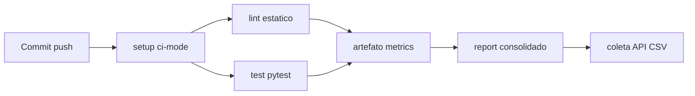

# Relatório técnico: métricas de pipeline CI/CD

**Projeto:** ponderada-cicd-lab (mini Analyzer inspirado no G01, Jacto Drones OS)  
**Autor:** João Victor Souza (souzajv)  
**Data do experimento:** 2026-06-08  
**Repositório:** https://github.com/souzajv/ponderada-cicd-lab  
**Workflow:** https://github.com/souzajv/ponderada-cicd-lab/blob/main/.github/workflows/ci.yml  
**Folha de entrega:** [ENTREGA.md](./ENTREGA.md)

## 1. Objetivo

Este relatório mede e analisa o comportamento de um pipeline CI/CD real no GitHub Actions. Um script Python consulta a API do GitHub, gera gráficos e sustenta a análise de desempenho, estabilidade e gargalos. O experimento dialoga com o Analyzer Service do projeto Kombi (g01), um mini-projeto derivado do trabalho do grupo.

## 2. Arquitetura do pipeline

O fluxo abaixo resume o que acontece em cada execução, desde o push até a geração dos entregáveis de análise.

```
push / workflow_dispatch
        │
        ▼
    ┌────────┐
    │ setup  │  lê ci-mode.json
    └────┬───┘
         │
    ┌────┴──────────────────────────────────────────┐
    │ parallel │ sequential │ inverted              │
    ▼              ▼                ▼                 │
 lint ──► test_sequential    test_inverted ──► lint_inverted
    │                                                 │
    └──► test_parallel                                │
         │                                            │
         ▼                                            │
 artefato pipeline-metrics-{run_id}                   │
         │                                            │
         ▼                                            │
    ┌─────────┐                                       │
    │ report  │  download artifacts + extra-report    │
    └────┬────┘                                       │
         ▼                                            │
 pipeline-report-{run_id}                              │
         │                                            │
         ▼                                            │
 coletar_metricas_pipeline.py ──► CSV/JSON/steps      │
         ▼                                            │
 gerar_graficos_pipeline.py + gerar_evidencias.py     │
```

## 3. Metodologia e bases de dados

A coleta foi feita pelo script [`coletar_metricas_pipeline.py`](./coletar_metricas_pipeline.py), usando o token obtido com `gh auth token`. Os artefatos gerados organizam os dados em camadas: bruto para auditoria, limpo para análise e detalhado por etapa.

| Artefato | Descrição |
|---|---|
| `pipeline_metricas.csv` | Todos os jobs coletados, incluindo runs inválidos |
| `pipeline_metricas_limpo.csv` | **19 runs válidos**, jobs sem `skipped`, duração ≥ 5s |
| `pipeline_steps.csv` | **525 steps** com duração por etapa (API `jobs[].steps`) |
| `dados/raw/run-*.json` | Cache bruto da API para auditoria |

### Evidências com links reais

A tabela completa das execuções está em [experimento/VARIACOES.md](../experimento/VARIACOES.md). Abaixo, uma amostra representativa.

| Variação | run_id | Link |
|---|---|---|
| 01 baseline | 27112464101 | https://github.com/souzajv/ponderada-cicd-lab/actions/runs/27112464101 |
| 02 teste falhando | 27112466672 | https://github.com/souzajv/ponderada-cicd-lab/actions/runs/27112466672 |
| 08 paralelo | 27112483564 | https://github.com/souzajv/ponderada-cicd-lab/actions/runs/27112483564 |
| 09 sequencial | 27112486298 | https://github.com/souzajv/ponderada-cicd-lab/actions/runs/27112486298 |
| 11 falha lint | 27112491871 | https://github.com/souzajv/ponderada-cicd-lab/actions/runs/27112491871 |

### Evidências visuais

Além dos links, geramos painéis a partir dos dados da API. Eles complementam a navegação no GitHub e deixam o experimento reproduzível sem depender de capturas manuais de tela.


## 4. Respostas às perguntas de análise

Com o dataset limpo em mãos, respondemos às oito perguntas do enunciado. Cada resposta aponta para números concretos e, quando couber, para o `run_id` que sustenta a conclusão.

### 4.1 Qual etapa mais contribuiu para o tempo total do pipeline?

A análise por steps em `pipeline_steps.csv` mostra, em média nos runs válidos, onde o tempo se concentra.

| Step | Duração média (s) |
|---|---|
| Instalar e testar (pytest) | 6,63 |
| Instalar dependencias (pip) | 5,35 |
| setup-python | 1,48 |
| upload-artifact | 0,81 |

No modo paralelo (run `27112483564`), o `workflow_duration` ficou em cerca de **22 segundos**, próximo de `max(lint, test)` somado ao setup. No modo sequencial (run `27112486298`), o tempo subiu para **34 segundos**, refletindo lint e test em série.

Em resumo, instalação de dependências e execução de testes dominam o tempo. Em paralelo, o gargalo passa a ser o job mais lento entre lint e test.

### 4.2 Houve diferença significativa entre execuções com e sem cache?

Comparando médias de `workflow_duration` no dataset limpo, o efeito do cache pip não se destacou neste experimento.

| Modo | Média (s) |
|---|---|
| cache ON (`pip_cache=true`) | 28,3 |
| cache OFF | 26,0 |

Em um par controlado (variações 06 e 07), a diferença foi de cerca de 2 segundos, algo em torno de 8%. O projeto é pequeno e o ganho do cache fica diluído no checkout e no setup do ambiente.

### 4.3 O paralelismo reduziu o tempo total? Em que condições?

O paralelismo fez diferença clara quando lint e test podiam rodar ao mesmo tempo.

| Modo | run_id | workflow_duration |
|---|---|---|
| parallel (08) | 27112483564 | **22s** |
| sequential (09) | 27112486298 | **34s** |
| inverted (10) | 27112489037 | **45s** |

O ganho frente ao sequencial foi de cerca de 35%. Na variação 05, com teste lento, o job de teste virou gargalo e o benefício do paralelismo ficou menos perceptível.

### 4.4 Quais falhas foram mais frequentes?

Entre os **19 runs válidos** do dataset limpo (incluindo runs pós-auditoria, como `27112901765`), a estabilidade foi alta.

- **success:** 17 (89,5%)
- **failure:** 2 (10,5%), ambas intencionais: variação 02 (teste) e variação 11 (lint)

Por tipo, houve uma falha de teste (`test_failures=1`) e uma de lint, com o job `lint` encerrando em cerca de 11 segundos.

### 4.5 O pipeline fornece feedback rápido o suficiente?

Os runs verdes ficaram entre **22 e 34 segundos**, dependendo do modo de execução. Na variação 11, a falha de lint apareceu em cerca de 16 segundos (setup mais lint), antes de gastar tempo em testes. Esse comportamento é adequado para fail-fast.

Martin Fowler descreve no *Deployment Pipeline* que os estágios devem ir do mais barato e rápido ao mais caro. Aqui, o lint estático (entre 11 e 17 segundos) precede os testes que instalam dependências e rodam pytest (entre 10 e 15 segundos). A variação 10, com ordem invertida, violou esse princípio e custou **45 segundos** contra **34 segundos** no sequencial padrão. Feedback rápido não é só pipeline curto: é colocar as checagens certas na ordem certa.

### 4.6 Que melhorias poderiam ser feitas?

As recomendações abaixo seguem a *Test Pyramid* e o fail-fast que Fowler defende para pipelines de integração.

1. **Checagens baratas primeiro:** manter lint antes de testes no caminho padrão e não replicar a ordem invertida da variação 10.
2. **Base da pirâmide rápida:** o CI já exclui `@pytest.mark.slow` por padrão (`-m "not slow"`). Testes lentos devem ficar em job opcional ou em execução noturna, fora do caminho crítico.
3. **Confiança para integrar:** `run-metrics.json`, JUnit e job `report` com `extra-report.json` já estão implementados na versão final, com `if: always()` no export.
4. Unificar os jobs `test_*` em um único job parametrizado, reduzindo ruído na API.
5. Adotar cache de `.pytest_cache` quando a suíte crescer; o retorno aumenta com mais testes unitários.
6. Habilitar `app:test` no GitLab do g01 com lint e test em paralelo.

### 4.7 Limitações dos dados

Alguns pontos limitam a generalização dos resultados, e por isso a análise principal usa o CSV limpo.

- Runs inválidos iniciais (YAML com duração 0s) permanecem no CSV completo apenas para auditoria.
- Jobs `skipped` poluíam versões anteriores e foram filtrados em `pipeline_metricas_limpo.csv`.
- Há variância entre runners compartilhados (`ubuntu-latest`).
- Artefatos no GitHub expiram em 90 dias; o CSV commitado no repositório preserva o histórico.

### 4.8 Como apoiar decisões de engenharia?

As métricas coletadas permitem transformar observação em regra de engenharia para o g01.

- Manter lint e test em **paralelo** quando `app:test` for habilitado no g01; a economia estimada é de cerca de 12 segundos por pipeline.
- Cache pip tem ROI baixo neste porte de projeto; vale reavaliar quando as dependências crescerem.
- Evitar ordem invertida (test antes de lint): adiciona cerca de 11 segundos sem ganho de qualidade.
- **SLO proposto (quality gate):** `workflow_duration` no percentil 95 abaixo de **40 segundos** nos runs verdes com suíte padrão (`not slow`). Os runs atuais ficam entre 22 segundos (paralelo) e 34 segundos (sequencial), dentro do SLO. As variações 05 (slow) e 10 (invertido) ficam fora do gate por desenho experimental e não devem bloquear merges no g01.

## 5. Métricas de processo (DORA)

As métricas DORA medem velocidade e estabilidade de entrega. Elas complementam, sem substituir, as práticas de *Continuous Integration* de Fowler: integração frequente, build que se auto-testa e correção imediata de falhas. DORA responde quão rápido e estável entregamos; Fowler responde como o pipeline gera confiança para integrar.

| Métrica DORA | Medição no experimento | Valor observado |
|---|---|---|
| Lead Time for Changes | `lead_time_s` (commit até conclusão) | média de cerca de 30s nos runs válidos |
| Deployment Frequency | pushes no experimento | 14 variações em cerca de 5 min |
| Change Failure Rate | failures / runs válidos | 2/19 ≈ **10,5%** |
| Time to Restore (proxy) | variação 02 até 03 (um push) | cerca de 30s até pipeline verde |

## 6. Resultados inesperados

Três achados merecem destaque porque contradizem expectativas iniciais ou revelam efeitos colaterais do desenho do pipeline.

1. **12 runs iniciais com 0s** por erro de YAML (composite action inválido), corrigido no commit `846b08a`.
2. **Cache pip sem ganho claro:** a hipótese de 20% de redução foi rejeitada; a média global ficou até ligeiramente maior com cache, dentro da variância do runner.
3. **Modo invertido mais lento** que o sequencial padrão (45s contra 34s), porque o lint só roda depois que o test termina, sem sobreposição.

## 7. Hipótese inicial vs observado

O registro em [hipoteses.md](../experimento/hipoteses.md) foi feito antes das execuções. A tabela abaixo compara o previsto com o medido.

| Hipótese | Previsto | Observado | Veredito |
|---|---|---|---|
| H1 Cache ≥20% | lint+test muito mais rápidos | ~8% em par isolado; média global inconclusiva | Rejeitada |
| H2 Paralelo ≈ max(lint,test) | ~22s | 22s (run 08) | Confirmada |
| H3 Mais testes = linear | aumento proporcional | 22 para 23 testes, +3s com slow | Parcial |
| H4 Teste lento domina | test >> lint | test 15s vs lint 13s | Parcial |
| H5 Lint fail-fast | lint antes de test (sequencial) | variação 11: lint falhou, test não rodou | Confirmada |

## 8. Gráficos

Os gráficos foram gerados a partir do dataset limpo. Os quatro primeiros atendem ao enunciado; os três seguintes aprofundam comparações úteis para decisão.

### Obrigatórios (dataset limpo)


### Extras


## 9. Recomendação para o pipeline G01 (GitLab)

As evidências quantitativas deste experimento sugerem quatro passos concretos para o pipeline do grupo.

1. Descomentar `app:test` em [`.gitlab/app.yml`](https://git.inteli.edu.br/graduacao/2026-1b/t13/g01/-/blob/develop/.gitlab/app.yml).
2. Executar `app:lint` e `app:test` em **paralelo** no stage `app_quality`.
3. Habilitar cache npm/pip: ganho marginal hoje, mas útil quando a suíte Jest (cerca de 2800 linhas) rodar no CI.
4. Replicar o padrão de artefato JUnit e script de coleta, como o `ci-build-report.js` já existente no g01.

## 10. Fundamentação teórica (Martin Fowler)

As conclusões numéricas ganham sentido quando lidas junto com a literatura de Martin Fowler. Não medimos tempos por acaso: cada variação testa um princípio que a engenharia de software já discute há anos.

### 10.1 Continuous Integration: sete práticas

Fowler lista práticas que definem integração contínua de verdade. A tabela abaixo mapeia cada uma ao que este repositório faz na prática.

| Prática CI (Fowler) | Status | Evidência no experimento |
|---|---|---|
| Repositório único de integração | OK | pushes em `main` disparam workflow |
| Build automatizado a cada commit | OK | [ci.yml](../.github/workflows/ci.yml) em todo push |
| Build self-testing | OK | `ruff` + `pytest` + JUnit em cada run |
| Todos veem o resultado | OK | [Actions](https://github.com/souzajv/ponderada-cicd-lab/actions) + badge no README |
| Build rápido | OK | de 22 a 34 segundos nos runs verdes (variações 08 e 09) |
| Ambiente de teste próximo ao dev | Parcial | `ubuntu-latest` + Python 3.11 fixo |
| Corrigir build quebrado imediatamente | OK | variação 02 corrigida na 03 ([27112469375](https://github.com/souzajv/ponderada-cicd-lab/actions/runs/27112469375)) |

### 10.2 Deployment Pipeline: estágios de confiança

O experimento cobre os estágios iniciais do *Deployment Pipeline*, focados em confiança para integrar, sem estágio de release manual.



Cada estágio acrescenta confiança para integrar. Só depois de lint e test verdes o artefato `pipeline-metrics-{run_id}` é publicado; o job `report` consolida métricas para análise offline. O pipeline não chega a deploy, o que é escopo adequado para um experimento de CI acadêmico.

### 10.3 Test Pyramid: estrutura da suíte

A suíte segue a pirâmide de testes: muitos testes rápidos na base e poucos lentos no topo.

| Camada | Quantidade | Tempo típico | Política no CI |
|---|---|---|---|
| Unitários rápidos | 22 testes (`-m "not slow"`) | de 6 a 10s no job test | **Sempre** no caminho crítico |
| Teste lento (`@pytest.mark.slow`) | 1 teste (`test_slow_hover_analysis`) | +3s sleep + overhead | Só na variação 05 (`run_slow_tests=true`) |
| E2E / UI | 0 | não aplicável | Fora do escopo (mini-analyzer) |

A variação 04, com mais testes na base, aumentou `test_count` com impacto quase linear (cerca de +3s). A variação 05, com teste lento no topo, elevou `workflow_duration` para **27 segundos**, confirmando o que Fowler prega: poucos testes lentos em cima, muitos rápidos embaixo. O marker `slow` em [`pyproject.toml`](../pyproject.toml) e o filtro `-m "not slow"` em [`ci.yml`](../.github/workflows/ci.yml) colocam essa pirâmide em prática no pipeline.

### 10.4 Métricas úteis vs vanity

Fowler alerta que métricas mal usadas viram *vanity metrics* ([Cannot Measure Productivity](https://martinfowler.com/bliki/CannotMeasureProductivity.html)). Neste experimento, `workflow_duration` por modo, `job_duration` por step e taxa de falha por tipo orientam decisão real (paralelo no g01, ordem lint antes de test). Já a média global de cache pip, diluída pela variância do runner, é inconclusiva e não deve servir para punir o time: o par controlado entre variações 06 e 07 é a leitura correta.

As limitações da seção 4.7 reforçam uma postura madura: medir para aprender e ajustar o pipeline, não para ranking individual.

### 10.5 Síntese

- **Teoria:** CI (sete práticas), Deployment Pipeline (estágios) e Test Pyramid (marker `slow`), todos com referência a Fowler.
- **Dados:** 19 runs, 525 steps, 7 gráficos, hipóteses confirmadas ou rejeitadas com `run_id`.
- **Decisão transferível:** lint e test em paralelo, SLO p95 abaixo de 40 segundos e testes slow fora do caminho crítico, aplicáveis ao GitLab do g01.

## 11. Reprodução

O passo a passo completo está em [`reproducao.md`](./reproducao.md).

## 12. Referências

- Fowler, M. [Continuous Integration](https://martinfowler.com/articles/continuousIntegration.html)
- Fowler, M. [Test Pyramid](https://martinfowler.com/bliki/TestPyramid.html)
- Fowler, M. [Deployment Pipeline](https://martinfowler.com/bliki/DeploymentPipeline.html)
- Fowler, M. [Cannot Measure Productivity](https://martinfowler.com/bliki/CannotMeasureProductivity.html)
- Humble, J. e Farley, D. *Continuous Delivery* (estágios de pipeline e confiança acumulada por estágio)
