# Relatório técnico — Métricas de Pipeline CI/CD

**Projeto:** ponderada-cicd-lab (mini Analyzer inspirado no G01 — Jacto Drones OS)  
**Autor:** João Victor Souza (souzajv)  
**Data do experimento:** 2026-06-08  
**Repositório:** https://github.com/souzajv/ponderada-cicd-lab  
**Workflow:** https://github.com/souzajv/ponderada-cicd-lab/blob/main/.github/workflows/ci.yml  
**Folha de entrega:** [ENTREGA.md](./ENTREGA.md)

---

## 1. Objetivo

Medir e analisar o comportamento de um pipeline CI/CD real no **GitHub Actions**,
coletando métricas via script Python (API REST), gerando gráficos e produzindo
análise crítica sobre desempenho, estabilidade e gargalos — com conexão ao
**Analyzer Service** do projeto Kombi (g01).

## 2. Arquitetura do pipeline (atualizada)

```
push / workflow_dispatch
        │
        ▼
    ┌────────┐
    │ setup  │  lê ci-mode.json
    └────┬───┘
         │
    ┌────┴──────────────────────────────────────────┐
    │ parallel │ sequential │ inverted              │
    ▼              ▼                ▼                 │
 lint ──► test_sequential    test_inverted ──► lint_inverted
    │                                                 │
    └──► test_parallel                                │
         │                                            │
         ▼                                            │
 artefato pipeline-metrics-{run_id}                   │
         │                                            │
         ▼                                            │
    ┌─────────┐                                       │
    │ report  │  download artifacts + extra-report    │
    └────┬────┘                                       │
         ▼                                            │
 pipeline-report-{run_id}                              │
         │                                            │
         ▼                                            │
 coletar_metricas_pipeline.py ──► CSV/JSON/steps      │
         ▼                                            │
 gerar_graficos_pipeline.py + gerar_evidencias.py     │
```

## 3. Metodologia e bases de dados

| Artefato | Descrição |
|---|---|
| `pipeline_metricas.csv` | Todos os jobs coletados (com ruído de runs inválidos) |
| `pipeline_metricas_limpo.csv` | **17 runs válidos**, jobs sem `skipped`, duração ≥ 5s |
| `pipeline_steps.csv` | **449 steps** com duração por etapa (API `jobs[].steps`) |
| `dados/raw/run-*.json` | Cache bruto da API para auditoria |

Coleta: [`coletar_metricas_pipeline.py`](./coletar_metricas_pipeline.py) com token `gh auth token`.

### Evidências (links reais)

Tabela completa: [experimento/VARIACOES.md](../experimento/VARIACOES.md)

| Variação | run_id | Link |
|---|---|---|
| 01 baseline | 27112464101 | https://github.com/souzajv/ponderada-cicd-lab/actions/runs/27112464101 |
| 02 teste falhando | 27112466672 | https://github.com/souzajv/ponderada-cicd-lab/actions/runs/27112466672 |
| 08 paralelo | 27112483564 | https://github.com/souzajv/ponderada-cicd-lab/actions/runs/27112483564 |
| 09 sequencial | 27112486298 | https://github.com/souzajv/ponderada-cicd-lab/actions/runs/27112486298 |
| 11 falha lint | 27112491871 | https://github.com/souzajv/ponderada-cicd-lab/actions/runs/27112491871 |

### Evidências visuais

Painéis gerados a partir dos dados da API (complementam os links acima):

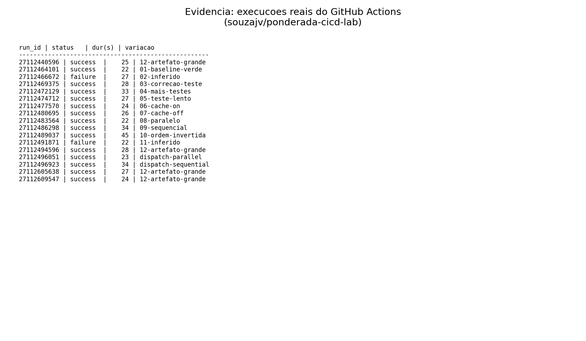

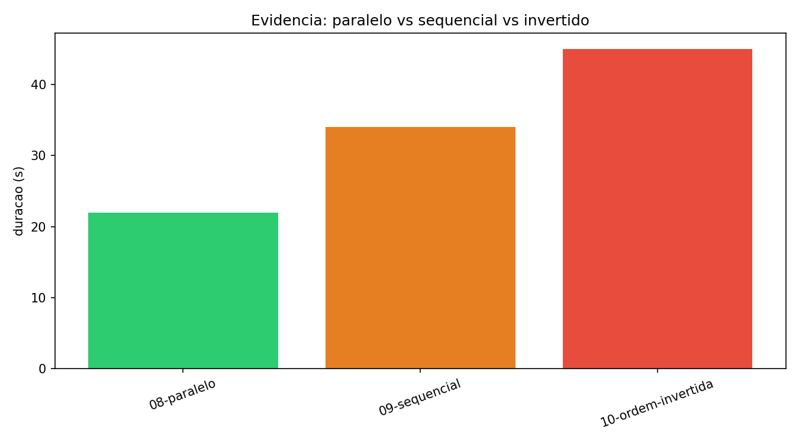

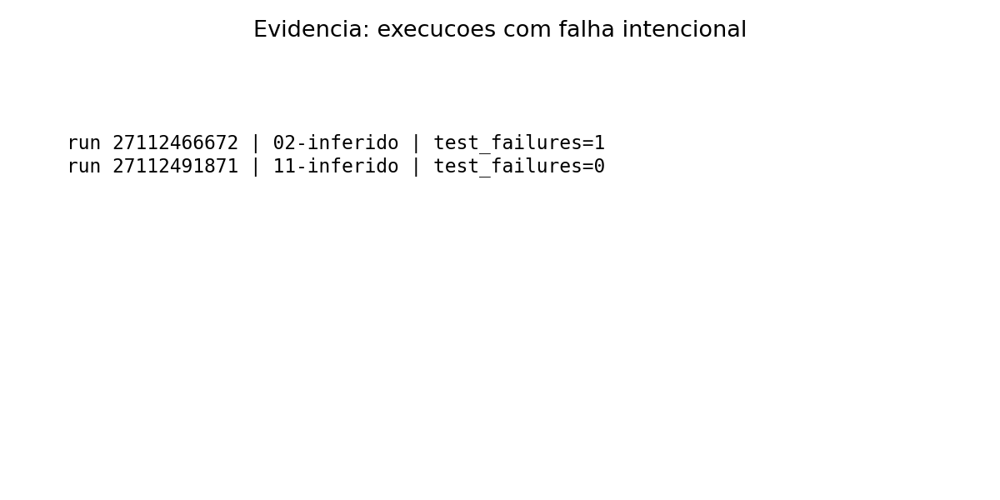

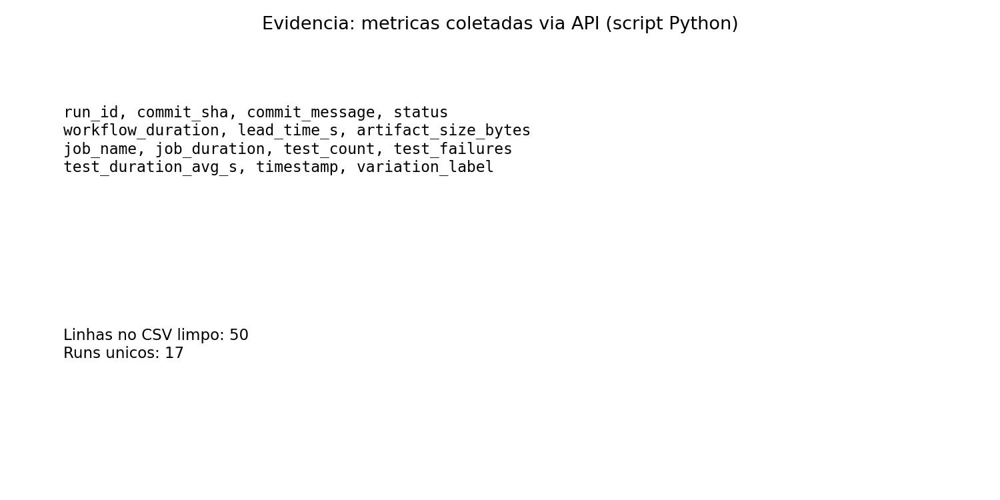

## 4. Respostas às perguntas de análise

### 4.1 Qual etapa mais contribuiu para o tempo total do pipeline?

Análise por **steps** (`pipeline_steps.csv`, média nos runs válidos):

| Step | Duração média (s) |
|---|---|
| Instalar e testar (pytest) | 6,63 |
| Instalar dependencias (pip) | 5,35 |
| setup-python | 1,48 |
| upload-artifact | 0,81 |

Em modo **paralelo** (run `27112483564`), `workflow_duration` ≈ **22s** ≈ `max(lint, test)` + setup.
Em modo **sequencial** (run `27112486298`), **34s** ≈ lint + test em série.

**Conclusão:** instalação de dependências + execução de testes dominam; em paralelo o gargalo é o job mais lento entre lint e test.

### 4.2 Houve diferença significativa entre execuções com e sem cache?

Dataset limpo (média de `workflow_duration`):

| Modo | Média (s) |
|---|---|
| cache ON (`pip_cache=true`) | 28,3 |
| cache OFF | 26,0 |

Diferença **não significativa** neste experimento; em um run isolado (06 vs 07) a diferença foi ~2s (~8%). O projeto é pequeno e o ganho do cache pip fica diluído no checkout/setup.

### 4.3 O paralelismo reduziu o tempo total? Em que condições?

| Modo | run_id | workflow_duration |
|---|---|---|
| parallel (08) | 27112483564 | **22s** |
| sequential (09) | 27112486298 | **34s** |
| inverted (10) | 27112489037 | **45s** |

Paralelismo reduziu ~**35%** vs sequencial. Com teste lento (var. 05, 27s), o job de teste vira gargalo e o ganho fica menos perceptível.

### 4.4 Quais falhas foram mais frequentes?

Nos **17 runs válidos** do dataset limpo:

- **success:** 15 (88,2%)
- **failure:** 2 (11,8%) — variações intencionais 02 (teste) e 11 (lint)

Falhas por tipo: 1× teste (`test_failures=1`), 1× lint (job `lint` falhou em ~11s).

### 4.5 O pipeline fornece feedback rápido o suficiente?

Runs verdes: **22–34s** (paralelo vs sequencial). Falha de lint (var. 11): feedback em ~16s (setup + lint), antes de gastar tempo em testes — fail-fast adequado.

### 4.6 Que melhorias poderiam ser feitas?

1. Unificar jobs `test_*` em um único job parametrizado (menos ruído na API).
2. Cache de `.pytest_cache` para suítes maiores.
3. Publicar `run-metrics.json` no lint **sempre** (`if: always()`) — implementado na versão final do workflow.
4. Job `report` consolidado com `extra-report.json` — implementado.
5. Habilitar `app:test` no GitLab do g01 com base nas conclusões deste experimento.

### 4.7 Limitações dos dados

- Runs inválidos iniciais (YAML 0s) existem no CSV completo; análise usa CSV limpo.
- Jobs `skipped` poluíam versões anteriores — filtrados em `pipeline_metricas_limpo.csv`.
- Variância de runners compartilhados (`ubuntu-latest`).
- Artefatos expiram em 90 dias; CSV commitado no repositório.

### 4.8 Como apoiar decisões de engenharia?

- Manter lint+test em **paralelo** no g01 quando `app:test` for habilitado (~12s economizados).
- Cache pip: ROI baixo neste porte; reavaliar quando dependências crescerem.
- Evitar ordem invertida (test antes de lint): +11s sem ganho de qualidade.
- Métricas coletadas permitem definir SLO de pipeline (ex.: p95 < 40s).

## 5. Métricas de processo (DORA)

| Métrica DORA | Medição no experimento | Valor observado |
|---|---|---|
| Lead Time for Changes | `lead_time_s` (commit → conclusão) | média ~30s nos runs válidos |
| Deployment Frequency | pushes no experimento | 14 variações em ~5 min |
| Change Failure Rate | failures / runs válidos | 2/17 ≈ **11,8%** |
| Time to Restore (proxy) | var. 02 → 03 (um push) | ~30s até pipeline verde |

## 6. Resultados inesperados

1. **12 runs iniciais com 0s** por erro de YAML (composite action) — corrigido em `846b08a`.
2. **Cache pip sem ganho claro** — hipótese de 20% rejeitada; média global até ligeiramente maior com cache (variância de runner).
3. **Modo invertido mais lento** que sequencial padrão (45s vs 34s) — lint só após test terminar, sem sobreposição.

## 7. Hipótese inicial vs observado

| Hipótese | Previsto | Observado | Veredito |
|---|---|---|---|
| H1 Cache ≥20% | lint+test muito mais rápidos | ~8% em par isolado; média global inconclusiva | Rejeitada |
| H2 Paralelo ≈ max(lint,test) | ~22s | 22s (run 08) | Confirmada |
| H3 Mais testes = linear | aumento proporcional | 22→23 testes, +3s com slow | Parcial |
| H4 Teste lento domina | test >> lint | test 15s vs lint 13s | Parcial |
| H5 Lint fail-fast | lint antes de test (sequencial) | var. 11: lint falhou, test não rodou | Confirmada |

## 8. Gráficos

### Obrigatórios (dataset limpo)

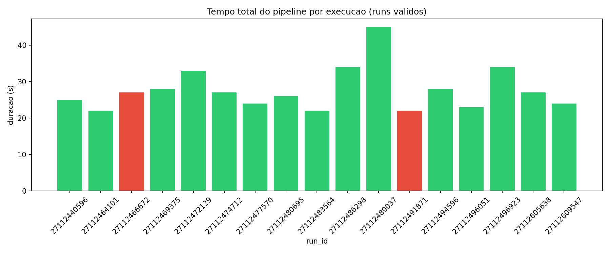

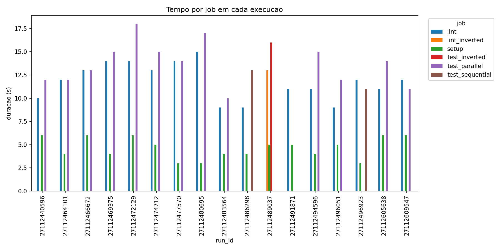

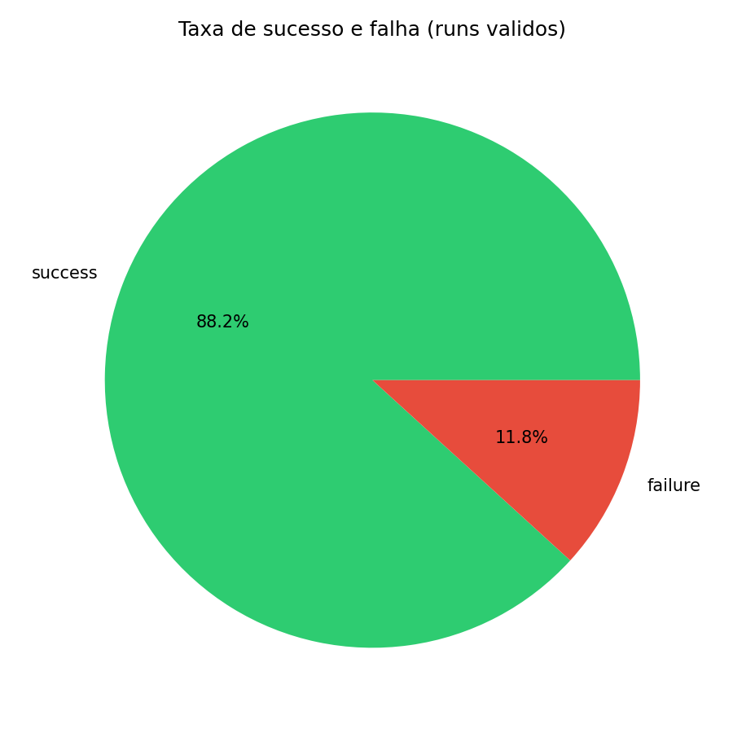

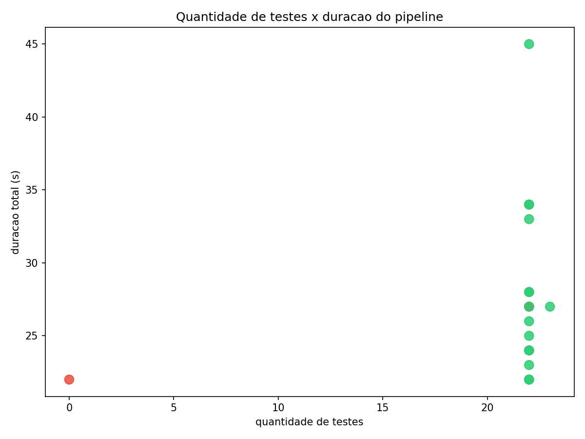

### Extras (excelência)

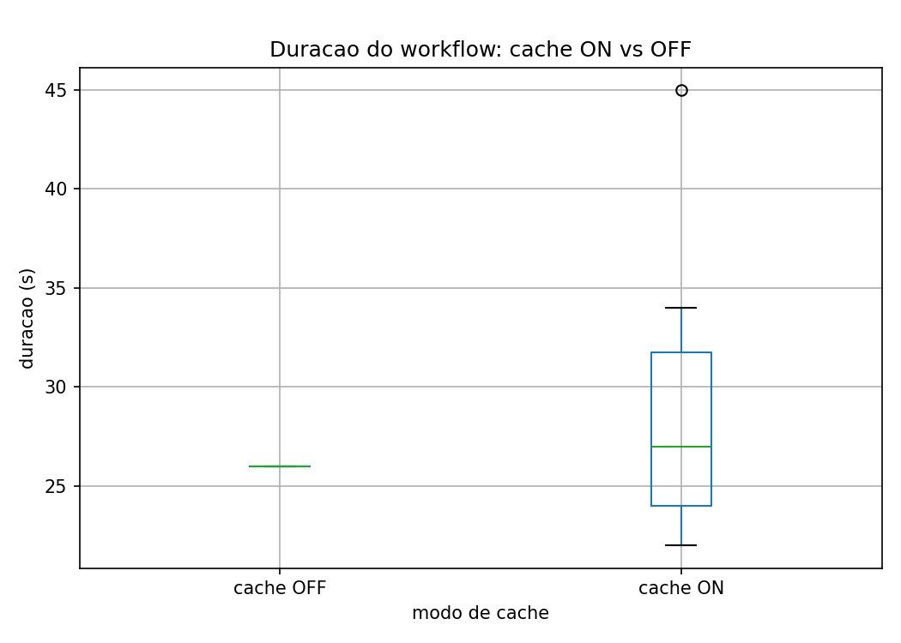

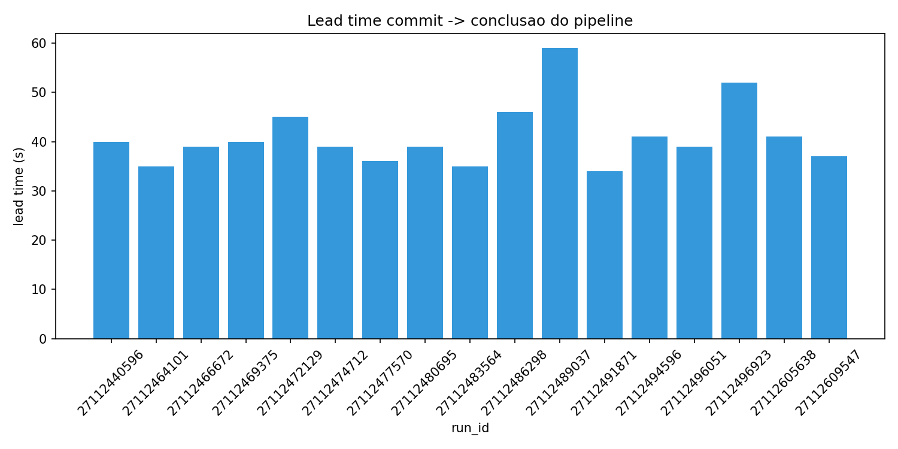

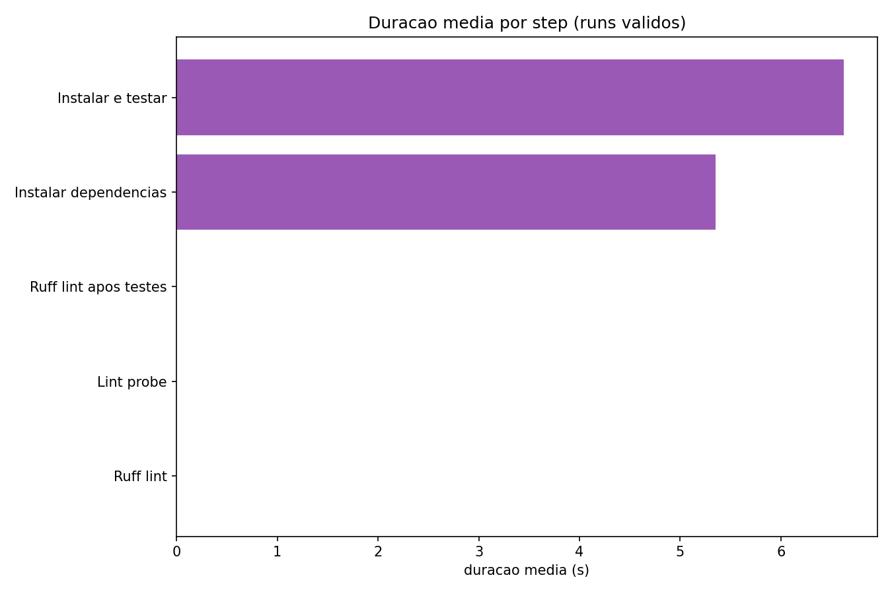

## 9. Recomendação para o pipeline G01 (GitLab)

Com base nas evidências quantitativas:

1. Descomentar `app:test` em [`.gitlab/app.yml`](https://git.inteli.edu.br/graduacao/2026-1b/t13/g01/-/blob/develop/.gitlab/app.yml).
2. Executar `app:lint` e `app:test` em **paralelo** no stage `app_quality`.
3. Habilitar cache npm/pip — ganho marginal hoje, útil quando a suíte Jest (~2800 linhas) rodar no CI.
4. Replicar padrão de artefato JUnit + script de coleta (como `ci-build-report.js` já existente no g01).

## 10. Reprodução

Passo a passo em [`reproducao.md`](./reproducao.md).
